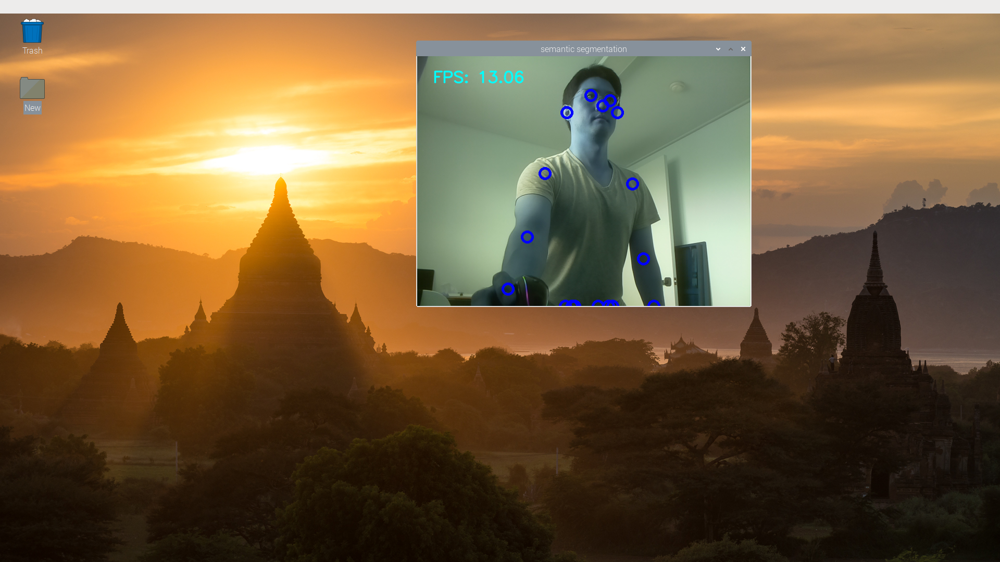

# Coral PoseNet

Pose estimation refers to computer vision techniques that detect human figures
in images and video, so that one could determine, for example, where someone’s
elbow, shoulder or foot show up in an image. PoseNet does not recognize
who is in an image, it is simply estimating where key body joints are.

This repo contains a set of PoseNet models that are quantized and optimized for
use on Coral's Edge TPU, together with some example code to shows how to run it
on a camera stream.

## Example outputs

By running the pose_picamera.py you can get pose information like the screenshot below.


### simple_pose.py

A minimal example that simply downloads an image, and prints the pose
keypoints.

```bash
python3 simple_pose.py
```

### squat_counter.py

By analyzing keypoints positions, it counts squat motions.

```bash
python3 squat_counter.py
```


### pose_camera.py

A camera example that streams the camera image through posenet and
draws the pose on top as an overlay. This is a great first example to run to
familiarize yourself with the network and its outputs.

Run a simple demo like this:

```bash
python3 pose_camera.py
```

If the camera and monitor are both facing you, consider adding the `--mirror` flag:

```bash
python3 pose_camera.py --mirror
```

In this repo we have included 3 posenet model files for differnet input
resolutions. The larger resolutions are slower of course, but allow a wider
field of view, or further-away poses to be processed correctly.

```bash
posenet_mobilenet_v1_075_721_1281_quant_decoder_edgetpu.tflite
posenet_mobilenet_v1_075_481_641_quant_decoder_edgetpu.tflite
posenet_mobilenet_v1_075_353_481_quant_decoder_edgetpu.tflite
```

You can change the camera resolution by using the --res parameter:

```bash
python3 pose_camera.py --res 480x360  # fast but low res
python3 pose_camera.py --res 640x480  # default
python3 pose_camera.py --res 1280x720 # slower but high res
```

## The PoseEngine class

The PoseEngine class (defined in ```pose_engine.py```) allows easy access
to the PoseNet network from Python, using the EdgeTPU API.

You simply initialize the class with the location of the model ```.tflite```
file and then call DetectPosesInImage, passing a numpy object that contains the
image. The numpy object should be in int8, [Y,X,RGB] format.

A minimal example might be:

```
import numpy as np
from PIL import Image
from pose_engine import PoseEngine

pil_image = Image.open('couple.jpg')
pil_image.resize((641, 481), Image.NEAREST)

engine = PoseEngine('models/mobilenet/posenet_mobilenet_v1_075_481_641_quant_decoder_edgetpu.tflite')
poses, inference_time = engine.DetectPosesInImage(np.uint8(pil_image))
print('Inference time: %.fms'%inference_time)

for pose in poses:
    if pose.score < 0.4: continue
    print('\nPose Score: ', pose.score)
    for label, keypoint in pose.keypoints.items():
        print(' %-20s x=%-4d y=%-4d score=%.1f'%
              (label, keypoint.yx[1], keypoint.yx[0], keypoint.score))
```

To try this, run
```bash
python3 simple_pose.py
```

And you should see an output like this:


```
Pose Score:  0.61885977
 nose                 x=210  y=152  score=1.0
 left eye             x=224  y=138  score=1.0
 right eye            x=199  y=136  score=1.0
 left ear             x=245  y=135  score=1.0
 right ear            x=183  y=129  score=0.8
 left shoulder        x=268  y=168  score=0.8
 right shoulder       x=161  y=172  score=1.0
 left elbow           x=282  y=255  score=0.6
 right elbow          x=154  y=254  score=0.9
 left wrist           x=236  y=333  score=0.7
 right wrist          x=163  y=301  score=0.6
 left hip             x=323  y=181  score=0.2
 right hip            x=191  y=251  score=0.0
 left knee            x=343  y=84   score=0.8
 right knee           x=162  y=295  score=0.0
 left ankle           x=318  y=174  score=0.1
 right ankle          x=167  y=309  score=0.0
```
